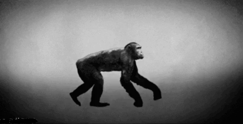
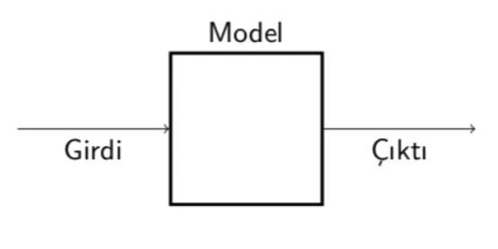

## Evrimsel Hesaplama - `CENG 415`

# Bölüm 1 - Çözülecek Problemler 
> Chapter 1 - Problems to Be Solved 

  

- **Optimisation, Modelling, and Simulation Problems** - Black Box Model (Kara Kutu modeli)
- **Search Problems** (Arama problemleri)
- **Optimisation Versus Constraint Satisfaction** - (En iyileme ve kısıt sağlama)
- **The Famous NP Problems** - (NP problemleri)

## 1. Black Box Modeli

  

Black box modelinde üç ana unsur vardır. Bunlar; Girdi, Model ve Çıktı. 

Kutu içinde bulunan modele bir değer veririz ki bu çıktıdır. Bu model bize bu girdiyi işleyerek bir çıktı verir.

Bu üç ana unsurdan bazlılarının eksik olması durumunda **`karşımıza farklı problemler ortaya koyar.`**

## 1.a Black Box Modeli - Eniyileme (Optimization)

  

**Bu model ve çıktı için uygun girdi nedir?**

Bu soruna `(optimizasyon problemlerine)` örnek problemler nelerdir?

- Eğtim kurumları için hazırlanan ders programları ya da çağrı merkezleri ve hastaneler için hazırlanan zaman çizegeleri.
- Bir tasarım geliştirken dikkak etmemiz gerken bir çok parametrenin var olması.
- Gezgin satıcı problemi
- Sekiz vezir problemi vb..

Bunlar ve benzerleri karşımıza çıkan optimizasyon promlemlerindendir. 

## Eniyileme Örneği 1: `Üniversite Ders Programı`

  

**Çok büyük bir arama uzayına sahip**: 

- Karşımıza çözüm olarak gelebilcek çok fazla durum söz konusu.
- Bu, arama uzayının çok fazla kıstastan ve seçenekten meynadana gelmesinden kaynaklarınıyor.
- Ve bu kıstas çakışmaları yüzünden zaten arama uzayının büyük çoğunluğu uygulanamaz çözümlerden oluşuyor.
- Biz arama uzayımız içinden bizim için en uygun olanları seçip çözüm odağımızı bu yollar üzerine kurmalıyız.

**`Tatties III uygulaması`**, evrimsel hesaplamalar kullanarak ve genetik algoritmalardan yararlanarak bizlere uygun ders programları oluşturmaya çalışan bir yazılımdır.

  

## Eniyileme Örneği 2: `Uydu yapısı`

  

- Uzaya gönderilen uyduların antenlerinin titreşimlere karşı mümkün olduğunca daynaklı olması gerekiyor. Bu da bir optimizasyon problemi.
- Bu optimizasyon problemlerini gidermek için de bu antenler ve uyduların tasarımları sırasında evrimsel hesaplama algoritmaları kullanılıyor.
- Bu örnektte **`fitness`** yani **uygunluk** titreşim direnci ile ölçülmekte. Titreşim direnci ne kadar yüksek bir tasarım ortaya koyarsak bu bizim ne kadar optimum bir tasarım yaptığımız manasına geliyor.

## Eniyileme Örneği 3: `Sekiz Vezir Problemi`

> n queens  
> [https://tr.wikipedia.org/wiki/Sekiz_vezir_bulmacası](https://tr.wikipedia.org/wiki/Sekiz_vezir_bulmacas%C4%B1)  
>[https://leetcode.com/problems/n-queens/#](https://leetcode.com/problems/n-queens/#)

<table><tr>
<td> 
  

    
     
    <em style="color: grey">Sekiz vezirin de satranç tahtasına örnek yerleştirilmiş hali</em>
  
 
</td>
<td> 
  

    
     
    <em style="color: grey"></em>
  
 
</td>
</tr></table>

> **`n vezir problemi`** de denir.

- Bu problemde tahtaya dizilecek olan **8 vezirin** de birbirini yiyemeden tahtada var olması gerekiyor. **8 yönde serbest hareket** edebilen vezir taşları **bu kritere uyularak tahtaya yerleştirilmeli.**
- n! 'lik bir çözüm uzayına sahibizi

## Eniyileme Örneği 4: `Gezgin Satıcı Problemi`

> Traveling Salesman Problem  
> [https://leetcode.com/problems/find-the-shortest-superstring/](https://leetcode.com/problems/find-the-shortest-superstring/)  
> [https://www.matematiksel.org/gezgin-satici-problemi/](https://www.matematiksel.org/gezgin-satici-problemi/)

  

- Bir seyyar satıcı, elindeki tüm malları **`n şehirde`** her şehre sadece 1 kez uğrayarak mümkün olan en kısa yoldan satmak istiyor.
- Halen bu problem için **polinomsal zamanda** çalışan bir algoritma bulunamamış durumda.

> Polinomsal zaman polinomsal olmayan zaman nedir bunlara birazdan bakacağız.

## 1.b Black Box Modeli - Modelleme

  

**Bu sefer girdi ve çıktı bilinirken bunlara uygun model'i bilmiyoruz** 

Genellikle dinamik ortamlar geliştririken **"... olursa ne olur"** sorusuna cevap olması için kullanılır.

Bu sorunun örnek problemleri:

- Evrimsel ekonomi, yapay yaşam
- Hava tahmin sistemleri
- yeni vergilerin etki analizi için

Bunlar ve benzerleri karşımıza çıkan modelleme promlemlerindendir. 

## Modelleme Örneği 1: `Kredi Başvuru Güvenirliği`

Bankalar kişiler kredi verirken verdikleri bu krediyi geri alıp alamayacaklarını hesap etmelidirler.

Bazı bankalar buna bir kestirim, bir öngörü ile karar vermekte. Peki bankalar nelere bakarak bu kararı veriyorlar:

- Kişini geçmiş dönemlerde aldığı kredilere nasıl bir davranış sergilediği
- Bankasındaki varlığı
- Gayrı menkül bilgisi

gibi kriterleri göz ederek aldığı krediyi ödeyip ödeyemeyeceğini modeleme yaparak belirlemeye çalışıyorlar.

Geçmiş veri üzerinde bu modelin doğruluğunu test etmiş oluyoruz. Yeni verilere de bu modeli uygulayarak bu modeli geliştirmeye devam etmiş oluyoruz.

## 1.c Black Box Modeli - Benzetim (Simulation)

  

**Girdi ve model bilinirken bu sefer de çıktıyı bilmiyoruz**

Bu sorunun örnek problemleri:

- Evrimsel makine öğrenmesi
- Borsa fiyatlarının tahmini
- Akıllı evler için ses kontrol sistemleri

**`Not:`** **Modelleme problemleri eniyileme problemlerine `dönüşebilir!`**

## Benzetim Örneği: `Yapay toplumlar geliştirmek`

> [https://www.amazon.com/Growing-Artificial-Societies-Science-Adaptive/dp/0262550253](https://www.amazon.com/Growing-Artificial-Societies-Science-Adaptive/dp/0262550253)

  

- Modelleri ayarlamak için ticaretin veya ekonomik rekabetin simule edilmesi (benzetilmesi) bir örnek olabilir.
- Buradaki modeller geliştirilecek olan streteji ve politikaları optimize etmek için (eniyilemek) için kullanılan modeller olarak karşımıza çıkacaktır.

# 2. **Search Problems**

> Arama problemleri

- **Arama problemleri,** benzetim(Simulation), eniyileme(optimization) ve modelleme problemlerinden farklıdır.
- Optimizasyon ve modelleme problemleri çok büyük arama uzaylarında arama yaparlar. Çözüm durumları çok fazla ve arama işlemi de çok uzun sürüyor.
- **Arama Uzayı:** İstenilen çözümün de bulunduğu ilgili bütün nesnelerin koleksiyonudur.

> **Soru:** N adet şehrin farklı sıralarda gezilmesi durumunda arama uzayının büyüklüğü nedir?  
**Cevap:** N!

Bu problemleri sınıflandırmanın faydası; 
**Arama problemleri** (arama uzaylarını tanımlar) **ile problem çözücüler** (arama uzayında nasıl ilerlenmesi/hareket edilmesi gerektiğini belirler) **arasındaki farkın belirlenmesidir.**

## Optimization vs Constrain Satisfaction

> Eniyileme karşı Kısıt Sağlama

 **Amaç fonskiyonu:** Bulmuş olduğumuz bir çözümün ne kadar kaliteli bir çözüm olduğunu bize sayısal bir değer ile gösterebilen bir fonksiyon.

N vezir probleminden yola çıkarsak;

- **(Ençoklama / Maximize)** Çakışmayan vezir sayısı, bir amaç fonskiyonu olabilir. Bu sayıyı ne kadar artıtırsak esas çözüme o kadar yaklaşmış olcağız.

Gezgin satıcı probleminden yola çıkarsak da;

- **(Enazlama / Minimize)** Şehirlerin kümesini dolaşırken katedilen yolu en aza indirmeye çalışıyoruz.

**Kısıt (Constraint):** Bir gereksinimin gerçekleşip gerçekleşmediğinin ikili değerlendirmesi.  
*Örnek olarak:* ...Şu sağlanıyor  mu? -Evet ya da Hayır ile cevap vereceğimiz durumlar.

- Herhangi iki vezirin birbiri ile çakışmadığı bir konfigürasyon bul

    > Bu kısıtı ya bulursunuz ya da bulamazsınız. Bu kısıtı bulduğunuz zaman problemi çözmüş olursunuz; bulamazsanız da çözmemiş olursunuz.

**Not:** Kısıt problemlerini eniyileme problemlerine dönüştürülebilir.

  

#### **`Soru:`** N-vezir problemini KEP / KSP ve BEP şeklinde nasıl temsil edebiliriz?

> **KEP** (Kısıtlı Eniyileme Problemi), **KSP** (Kısıtlı Sağlama Problemi), **BEP** (Bağımsız Eniyileme Problemi)

**BEP:** Çakışmayan vezir sayısı amaç fonksiyonu

**KSP:** Herhangi iki vezirin birbiri ile çakışmadığı bir konfigürasyon bul

**KEP:** *Her ikisini de kullanabiliriz.* Çakışmayan vezir sayısını arttır ve de birbirleri ile çakışmayan bir konfigrasyon bul

---

Bu ana kadar problemleri sınıflandırdık, fakat problem çözücüleri incelemedik. Bu sınıflandırma şeması problem çözücülerin özelliklerine ihtiyaç duyar.

Bu şema ile Problemlerin ne kadar zor olduğunu söyleyebiliriz.

# 3. NP Problemler

### `Anahtar Kavramlar:`

**Problem size (Problem büyüklüğü):** Eldeki problem boyutunu ve problem değişikleri için mümkün değer sayısını temsil eder.

**Running time (Çalışma zamanı):** Algoritmanın çalışması için gerekli işlem sayısı

**Worst case:** Problem büyüklüğünün bir fonksiyonu olarak en kötü durum.

**Çalışma zamanı çeşitleri:** Polinomsal(polynominal), süper-polinomsal, üssel(expoential) 

**Problem reduction (Problem indirgeme):** Mevcut problemi izdüşümü yaparak başka bir probleme dönüştürme.

### **`Problem sınıfları:`**

Problem zorlukları aşağıdaki şekilde sınıflanabilir.

**P Sınıfı:** Algoritma problemi **`polinomsal zamanda çözebilir.`** (n büyüklüğündeki bir problem için en kötü durumda çalışma zamanı F(n)'den azdır, F polinomsal bir fonksiyon)

**NP Sınıfı (Non-polynominal):** Problem çözülebilir ve herhangi bir çözüm başka bir algoritma tarafından polinomsal zamanda doğrulanabilir.(P, NP'nin alt kümesidir.)

**NP-Complete (NP-Tam) Sınıfı:** Problem NP Sınıfına aittir ve NP sınıfındaki başka bir problem bu probleme polinomsal zamanda çalışan bir algoritma tarafından indirgenebilir.

**NP-Hard (NP-Zor) Sınıfı:** Problem en az NP-tam sınıfındaki bir problem kadar zordur fakat çözüm polinomsal zamanda doğrulanmak zorunda değildir.

- P, NP-Hard'dan farklıdır.
- P'nin NP'den farklı oldup olmadığı bilinmemektedir.

Burada iki farklı kabulü görmektesiniz bunların henüz doğruluğu kanıtlanabilmiş değil.

Bu kabuller;

- Bütün NP problemler bir şekilde P problemlere indirgenebilir. `**P = NP**`
- Bir kısım da indirgenemez diyor. `**P ≠ NP**`

  

> **Bu P eşit midir NP sorusu** ödüllü bir sorudur. Cevabı bulana **1,000,000 dolar**'lık bir ödül verilmekte. Cevabı bulabilenler **CMI Clay Matematik Enstitüsü**'ne başvurabilir.

## Kaynakça

- Öğr. Gör. [**Şevket Umut Çakır**](https://www.pau.edu.tr/sucakir/)  ders sunumları. 

- [`Introduction to Evolutionary Computing 2nd Edition`](https://www.springer.com/gp/book/9783662448731) ders kitabı.

