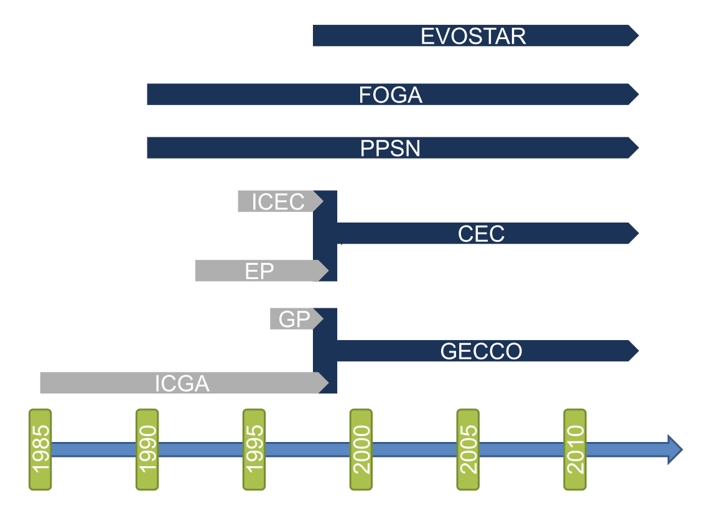
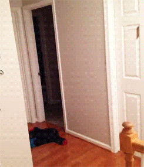
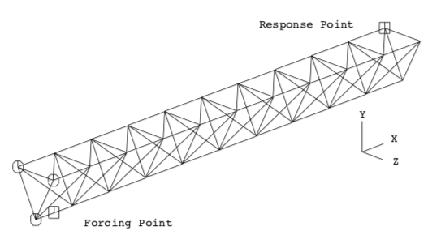
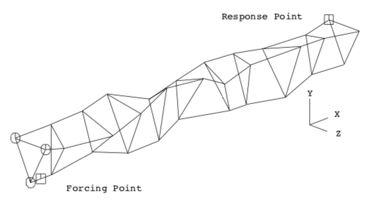

## Evrimsel Hesaplama - `CENG 415`

# Bölüm 2 - Evrimsel Hesaplamanın Kökleri
> Evolutionary Computing: The Origins

Bu  bölümde; 

- **Tarihsel Perspektif**
- **Biyolojik Esinlenme**
    - Darwin'in Evrim teorisi
    - Genetik
- **Evrimsel Hesaplama Motivasyonu**

Bu kavramlardan bahsedeceğiz.

## 2.1 **Tarihsel Perspektif**

> Brief History

- **1948:** Turing **Genetik veya Evrimsel Aramayı** önerir.
- **1962:** Bremermann **Evrim ve Birleşme (çaprazlama) Yoluyla Optizmiazsyonu** önerir.
- **1964:** Rechenberg **Evrim Stratejisini** önerir.
- **1965:** L.Fogel, Owens ve Walsh **Evrimsel Programlamayı** önerirler
- **1975:** Holland **Genetik Algoritmaları** önermiştir.
- **1992:** Koza **Genetik Programlamayı** önerir.
    - Daha çok ağaç veri yapısını kullanarak çeşitli programlar yazmayı hedefleyen yöntem ortaya çıkıyor.
- **1995:** İlk uluslararası konferans (ICGA) *International Conference on Genetic Algorithms*
- **1990:** Avrupa'daki ilk uluslararası konferans (PPSN) *Parallel Problem Solving from Nature*
- **1993:** İlk bilimsel evrimsel hesaplama dergisi ([MIT Press](https://mitpress.mit.edu/))
- **1997:** Avrupa Evrimsel Hesaplama Araştırma Ağı'nın başlatılması (EvoNet)

    
     
    <em>Brief sketch of the EC conference history</em>

> ***21. Yüz yılın başlarında Evrimsel Hesaplama;***

- 3 büyük ve ilişkili 10 küçük konferans
- 4 bilimsel büyük evrimsel hesaplama dergisi
- Geçtiğimiz yıl içinde 1000+ yayınlanmış evrimsel hesaplama makalesi (tahmini)
- [**Sayısız uygulama**](http://pajes.pau.edu.tr/jvi.aspx?pdir=pajes&plng=tur&un=PAJES-91885&look4=)
- Sayısız danışmanlık ve ar-ge firması
- Birçok [**üniversite müfredatında**](http://ebs.pau.edu.tr/BilgiGoster/Ders.aspx?lng=1&dzy=3&br=21&bl=65&pr=167&dm=655&ps=3&dk=36168&ds=0) yer alıyor.

# 2.2 **Biyolojik Esinlenme**
> The Inspiration from Biology

## 2.2.1 Darwin'in Evrim teorisi
> Darwinian Evolution

Bu bir teoridir yani doğruluğu henüz kanıtlanmış değildir. Doğuruluğu kanıtlandığında bunu bir bilimsel kanun olarak kabul edebiliriz. Bu maddede bu teorinin evrimsel hesaplamaya katkılarıdan kısaca bahsedeceğiz.

    
     
    <em></em>

**Survival of the fitnest:** En güçlünün hayatta kalması (doğal seçilim/seleksiyon)

- Bütün ortamlar sonlu kaynaklara sahiptir. Bu sebeple ortamlar belirli bir sayıda canlının yaşamasına imkan sunabilir.
- Canlılar da yaşam döngülerini devam ettirmek için üremeye yönelik temel bir içgüdüye sahiptir.
- Kısıtlı kaynaklar ve yaşamak isteyen onca canlı arasında bir seçilim süreçi kaçınılmazdır.
- Bu durumda kaynaklar için en iyi mücadele eden bireylerin üreme şansı daha yüksek olacaktır.
- Hayatta kalama özellikleri güçlü olan bireylerin (uyum gücü, **fitness**) sonraki nesillerinin de hayatta kalma özellikleri güçlü olacaktır. Bu nesilden nesile aktarılan bir özelliktir.

> **`Çeşitlilik değişime yol açar.`**

## Fenotip ve genotip

Fenotip özelikler;

- Çevreye tepkiyi etkileyen davranışlar. / Fiziksel farklılıklar.
- Kısmen kalıtım ile kısmen de gelişim sürecinde çevrenin etkileri ile ortaya çıkar.
- Fenotip çevresel etkenlerlerin canlılar üzerindeki etkisi ile değişebilir.

Eğer fenotipik özelikler;

- Daha yüksek üreme şansına sebep oluyorsa **alt nesillere aktarılabilir.**

**Fentip özelikler;** davranış olabilir, boy, kilo gibi dış özelikler olabilir.

## Adaptif Yüzey Metaforu (Wright 1932)

> Metaphor of an Adaptive Landscape

- Z ekseni (yükseklik) uygunluk değerini (fitness) gösterir.

    Grafikte yüksekliğiniz ne kadar fazla ise hayatta kalma ihtimaliniz o kadar yüksektir.

- XY düzlemi mümkün olan bütün özellik kombinasyonlarını temsil eder
- Yüksekliğin fazla olması uygunluk değerinin yüksek / iyi  olduğunu gösterir.
- Her bir birey yüzeydeki bir nokta ile ifade edilir.
- Popülasyon bir nokta buluturdur ve evrildikçe yüzey üzerinde hareket eder.

    
     
    <em></em>

Seçme işlemi popülasyonu yüzey üzerinde yukarı doğru iter.

**Genetik kayma / sürükleme (Genetic dirft)**

Güçlü bireylerin popülasyonu ele geçirmesi ve popilasyondaki bireylerin daha çok bu güçlü bireylere benzemesi durumuna **genetik kayma** diyoruz.

- Popülasyondaki birey sayısı kısıtlıdır, seçme ve değişm operatörleri bireyleri yüzeyde başka noktalara taşır.
- Genetik kayma ile güçlü olan bireyler kaybolabilir ya da çeşitlilik azalabilir.
- Genetik kayma sonucunda bireyler aşağı da hareket edebilir, yukarı da
- Bizim amaçımız bireyimiz ya da polisayonumuzu **yerel optimum noktalardan** kaçarak **global optimum noktalara** eriştimekdir.

## 2.2.2 Genetik

> Genetics

Canlı bir organizmayı inşa etmek için gerekli olan bilgi o organizmanın DNS'sında kodlanmıştır.

Genotip, fenotip belirler

Genlerden → fenotipik özelliklere karmaşık bir izdüşüm söz konusudur

- Bir gen birden fazla özelliği etkileyebilir (pleiotropy)
- Birden fazla gen bir özelliği etkileyebilir (ploygeny)

Gendeki küçük değişiklikler organizmada küçük değişikliklere neden olur (boy, saç rengi gibi) 

    
     
    <em></em>

## Genler ve Genomlar

Genler, kromozom adı verilen DNA sarmallarında kodlanmıştır.

Birçok hücrede her bir kromozomun iki kopyası mevcuttur. (**diploid**)

Bir bireyin genotipindeki tüm genetik malzeme **genom** olarak adlandırılır.

Türler içinde genetik malzemenin çoğu aynıdır.

    
     
    <em></em>

## Homo Sapiens

İnsan DNS'sı kromozomlardan oluşur

İnsanların vücut hücreleri bireylerin fiziksel özelliklerini belirleyen **23 çift kromozomdan** oluşur.

    
     
    <em></em>

## Üreme Hücreleri

Gametler (sperm ve yumurta hücreleri) 23 tekil (çift değil) kromozom içerirler.

Her bir kromozomun yalnızca bir kopyasını içeren hücrelere **haploid** denir.

Gametler mayoz (meiosis) adı verilen bir bölünme gerçekleştirler.

Mayoz bölünme esnasında kromozom çiftleri çarpazlama (crosing-over) adı verilen bir işlem geçer.

    
     
    <em></em>

## Mayoz bölünme esnasında Çaprazlama

Kromozom çiftleri hizalanır ve birer kopyaları oluşturlar

İçte kalan çiftler bir sentromerden (centromer'e) bağlanır ve parçalarnı değiştiriler

İşlemin çıktısı anne/baba krmozomun yanındaki iki tane kombinasyondur.

Çaprazlama sonunda her bir çift bir gamet'e gider. 

## Döllenme

    
     
    <em></em>

## Döllenme sonrası

Yeni zigot, aynı genetik içeriğe sahip olcak şekilde hızlıca bölünür.

Bütün hücreler aynı genlere sahip olmasına rağmen, organizmadaki konumlarına göre farklı davranacaklardır.

Gelişim sürecindeki bu farklı davranışa **otogenesis** adı verilir

Bütün hepsi DNA içindeki genlerin kodların çözülmesi için aynı mekanizmayı kullanır.

## Genetik Kod

Dünyadaki canlılarda bulunan bütün proteinler 20 farklı amino asitten inşa edilmiştir.

DNA çift sarmal spiral şeklinde **4 nükleotidden** oluşur. 

**Pürin:** Adenein,Guanin ; **Primidin:** Timin, Sitozin

Üçlü nükleotidler kodonları oluşturur ve bunlar amino asitleri kodlar.

Ekstra bilgi

- Pürünler, primidinleri tanımlar
- DNA içinde çok fazla gereksiz kısım barındırır.
- 4^3 = 64 kodon, 20 farklı amino asidi kodlar
- genetik kod = kodonlardan →amino asitkere bir izdüşümdür

Dünya üstündeki tüm doğal yaşam için genetik kod aynıdır.

    
     
    <em></em>

## Transcription, Translation

**Transcription:** DNA'daki bilginin RNA'ya yazılır

**Translation:** RNA'dan protein dizlimine geçiş

    
     
    <em></em>

Moleküler genetikde **iki farklı** idda mevcuttur. bunlar;

- **(Darvin)** Moleküller genetikte merkezi bir idda: **tek yönlü geçiş**

    Genotip ⇒ Fenotip

    Genotip ⇍ Fenotip

- **Lamarkizm**'e göre sonradan elde edilen özellikler **miras alınabilir** ki yukarıdaki kabule göre bu yanlıştır.

## Mutasyon

Bazen, bu süreç sırasında organizmaların genetik materyali çok az değişime uğrar (çoğaltma hatası)

Bu çocuk bireyin her iki ebeveynden de almadığı genetik materyal bilgisine sahip olduğunu gösterir.

Bu üç farklı şekilde sonuçlanabilir

- **Katastrofik:** Yavru yaşayamaz (çoğunlukla)
- **Doğal:** Yeni özellik uyumu / uygunluğu değiştirmez
- **Avantajlı:** Güçlü yeni bir özellik ortaya çıkar.

# 2.3 Evrimsel Hesaplam Motivasyonu

Problem çözücüler (algoritmalar) geliştirmek matematik ve bilgisayar bilimlerinin ana temalarından biridir. **Mühendisler** çözüm üretmek için **doğadan sıklıkla illham** almaktadır.

Doğadaki problem çözücülere baktığımızda iki aday göze çarpar

- **İnsan beyni:** nöro hesaplama
- **Evrim süreci:** evrimsel hesaplama

20. yüzyılın ikinci yarısı ile birlikte artan bilgisayarlı hesaplama, otomatik problem çözmeye olan gerksinimi artmıştır.

Paralel hesaplama teknikleri ve problem analizleri ile problem çözümü için gereken süre azalmaktadır.

Kabul edilebilir sürede doğru sonuç veren(en iyisi olmasa da), geniş alana uygulanabilen ve mümkün olduğunca az ayarlama gerektiren algoritmalara gereksinim artmıştır.

## Uydu için anten tasarımı

> Satellite structure

İlk derste bahsetiğimiz [**uydu yapısı örneği**](https://github.com/hasantezcan/evolutionary-computing-notes/blob/main/_data/weeks/week1/problems-to-be-solved.md#eniyileme-%C3%B6rne%C4%9Fi-2-uydu-yap%C4%B1s%C4%B1) 

Keane ve Brown uzay boşluğunda uyduların antenlerindeki titreşimi
azaltmak için bir çalışma yapmıştır[2].

<table><tr>
<td> 
 

    
     
    <em>Başlangıç tasarımı</em>

</td>
<td> 
 

    
     
    <em>Genetik algoritma ile bulunan</em>

</td>
</tr></table>

Gentik algoritma ile bulunana baktığımızda yamuk yamuk bir tasrım görüyor olsak da uzaydaki titreşimi en iyi abzorbe eden tasarım bu gördüğümüz tasarım.

## QWOP Genetik Algoritma Eğitimi
QWOP oyununu evrimsel hesaplama algoritmaları ile çalıştırdığımızda elde edilen sonuçları gösteren bir [**test ortamı**](https://rednuht.org/genetic_walkers/). Dilerseniz QWOP oyununu**[buradan](http://www.foddy.net/Athletics.html)** siz de oynayabilirsiniz.

    
     
    <em></em>

## Bipedal Evrim Stratejisi

Evrimsel hesaplama algoritmaları kullanılarak optimize edilmiş yürütme modelleri. Detaylıca incelemek iserseniz. **[[video]](https://www.youtube.com/watch?v=pgaEE27nsQw)**

    
     
    <em></em>

## Kaynaklar

- [Öğr. Gör. Şevket Umut Çakır](https://www.pau.edu.tr/sucakir/) ders sunumları.
- [`Introduction to Evolutionary Computing 2nd Edition`](https://www.springer.com/gp/book/9783662448731) ders kitabı.

> *Görsellerin kaynakları (sırası ile)*

- [https://www.pinterest.co.uk/pin/406590672593039956/](https://www.pinterest.co.uk/pin/406590672593039956/)

- [https://en.wikipedia.org/wiki/Ploidy](https://en.wikipedia.org/wiki/Ploidy)

- [https://cmlsupport.org.uk/section/inside-cell](https://cmlsupport.org.uk/section/inside-cell)

- [https://ib.bioninja.com.au/standard-level/topic-3-genetics/33-meiosis/stages-of-meiosis.html](https://ib.bioninja.com.au/standard-level/topic-3-genetics/33-meiosis/stages-of-meiosis.html)