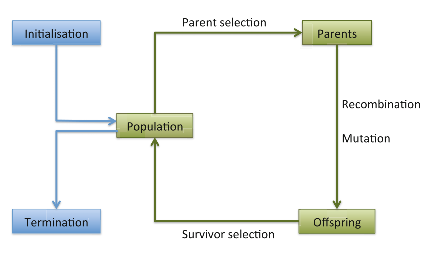

## Evrimsel Hesaplama - `CENG 415`

# Bölüm 3 - Evrimsel Hesaplama Nedir?

> What Is an Evolutionary Algorithm?

---

## EH Metaforu Hatırlatma

- Bireylerin oluşturduğu popülasyon kaynakları, kısıtlı bir ortamda
bulunur.
- Kaynaklar için oluşan rekabet, ortama **daha iyi uyum sağlayan (fitness)**
bireylerin seçilimine sebep olur.
- Bu bireyler, **rekombinasyon** ve **mutasyon** yoluyla yeni bireylerin
oluşumu için tohum görevi görür. *Özelliklerini büyük oranda yeni nesillere aktarırlar.*
- Yeni bireylerin uygunlukları değerlendirilir ve hayatta kalmak için
(muhtemelen ebeveynleriyle de) rekabet eder.
- Doğal seçilim, zamanla popülasyonun uygunluğunun artmasına neden
olur.
- Evrimsel hesaplama algoritmaları, **"oluştur ve test et"** algoritma
kategorisindedir. *Yeni bireyler üretiyoruz (popliasyon oluşturuyoruz) ve bu bireylerin uygunluğunu ya da uyumunu test ederek bir çalışma izliyoruz.*
- Stokastik, popülasyon temelli algoritmalardır.

    > **Stokastik Nedir?**
    Stokastik, değişken, rastlantısal anlamına gelen sıfat. Rastsal, rastgele gerçekleşen olayalar için söylenir.

    Bu kavramın **tam zıttı** olarak da deterministik kavramını söyleyebiliriz.
    Deterministik olaylar, ne olursa olsun sonuçları belirli olaylardır. Örnek olarak; `2 + 2 = 4` gibi. Bu işlem herzaman için (hava yağmurlu da olsa, karlı da olsa) bize aynı sonuçu verecektir. Herhangi bir etkene bağlı kalmadan gerçekleşen deterministik bir sürecin ürünüdür.

    Fakat sonuçumuz bazı rastsal değişkenlere bağlı ise; bu sürecin **stokastik bir süreç olduğunu gösterir.** Bu gün havanın nasıl olacağının cevabı gibi. Bu sonuçun oluşmasında bir çok **rastsal** etken etmen olduğundan sonucun ne olacağı başından belli değildir. **[[0]](https://en.wikipedia.org/wiki/Stochastic)**

- Varyasyon operatörleri (rekombinasyon ve mutasyon) gerekli çeşitliliği
yaratır ve böylece yeniliği kolaylaştırır.
- Seçim, çeşitliliği azaltır ve kalite artımını zorlayan bir güç görevi görür. *Seçim çeşitliliği azaltır, kaliteyi arttırır.*

---

# Bölüm 3 - Evrimsel Hesaplama Nedir?

> What Is an Evolutionary Algorithm?

Bu bölümde; 

- 3.1 **Evrimsel Hesaplama Şeması**
- 3.2 **Ana Evrimsel Hesaplama Bileşenleri**
    - 3.2.1 **Temsil**
    - 3.2.2 **Değerlendirme(Fitness) Fonksiyonu**
    - 3.2.3 **Popülasyon**
    - 3.2.4 **Seçme mekanizması**
    - 3.2.5 **Çeşitlilik Operatörleri**
        - 3.2.5.a **Mutasyon**
        - 3.2.5.b **Rekombinasyon**
    - 3.2.6 **Başlatma ve Sonlandırma**
    - 3.2.7 **Farklı Evrimsel Hesaplama Türleri**
- 3.3 **Örnek: 8-Vezir Problemi**
- 3.4 **Tipik Evrimsel Hesaplama Davranışı**
- 3.5 **Evrimsel Hesaplama ve Küresel Eniyileme**
- 3.6 **Evrimsel Hesaplama ve Komşuluk Araması**

başlıklarından bahsedeceğiz.

## 3.1 **Evrimsel Hesaplama Şeması**

<p align="center">
    
    <br>
    <em></em>
</p>

The general scheme of an evolutionary algorithm as a flowchart

Evrimsel hesaplama şemasını başlatırken bir popülasyon (birey kümesi) oluşturuyoruz.

Popülasyon içindeki elemanların fitness'ları değerlendirildikten sonra ebeveyn seçimi (Parent selection) gerçekleştiriliyor. Bu aşama hangi bireylerin üreme için kullanıldığını belirlediğimiz kısım. Burdan çıkan sonuçlar ile bir ebeveyn havuzu (şemada parents ile gösterilen kısım) oluşturuluyor. Bu havzdan ki bireyler arasında Recombination (çarprazlama) yönetemi ile yeni bireylerin oluşması sağlanıyor. Bu yeni bireyler oluştukdan sonra belirli bir rastgelelik ile mutasyona uğratılmakta mutasyon sonucunda da daha farklı, çeşitli bireyler ortaya çıkmış oluyor. Bu aşamanın ardından offspring (çocuklar) adında bir küme elde ediyoruz. Ve sonraki aşamada hayatta kalan bireyler ile bu döngü tekrar ediyor. Çocukların hayatta kalnları tespit edilirken de fitnes göz ediliyor. 

> Bir çok evrimsel hesaplama algoritmasında popülasyon boyutu sabit olarak kabul ediliyor. Bu şekilde daha kontrollü bir süreç izleyebiliyorsunuz.

Bu evrimsel hesaplma şemasını **sözde kod** olarak ifade etmek gerekirse;

```ruby
BASLA
	B a s l a n g i c populasyonunu r a s t g e l e o l u s t u r ( INITIALISE )
	Her a d a y i d e g e r l e n d i r (EVALUATE)
	B i t i s k o s u l u s a g l a n a n a k a d a r TEKRARLA(REPEAT)
		1 E b e v e y n l e r i s e c (PARENT SELECT )
		2 E b e v e y n l e r i c a p r a z l a (RECOMBINE)
		3 Y a v r u l a r i mutasyona t a b i t u t (MUTATE)
		4 Y e n i a d a y l a r i d e g e r l e n d i r (EVALUATE)
		5 Sonraki n e s i l e hayatta k a l a c a k l a r i
		s e c (SURVIVOR SELECT )
BITIR
```

### Evrimsel süreçlerin ortak modeli

- Bireylerden oluşan **popülasyon**
- Bireylerin **uygunluk (fitness)** değerleri var
- **Çeşitlilik (variation)** operatörleri: çaprazlama ve mutasyon
- Uygunluk değeri büyük olanın **seçilimi**
    - En güçlünün hayatta kalması
    - En güçlünün çiftleşmesi/üremesi

### Evrimin iki ayağı

İki rakip güç var

Popülasyon **çeşitliliğini artıran** genetik operatörler

- mutasyon
- çaprazlama

**Yeniliği** (novelty) artırır

Popülasyon **çeşitliliğinin** seçilim ile **azalması**

- hayatta kalanların
- ebeveynlerin

**Kaliteyi** artırır

---

# 3.2 **Ana Evrimsel Hesaplama Bileşenleri**

> Components of Evolutionary Algorithms

## 3.2.1 Temsil

> Representation (Definition of Individuals)

**Rolü:** Çeşitlilik operatörleri tarafından değiştirilebilecek, aday çözümler için bir kod sağlar

İki farklı şekilde ortaya çıkar;

- **fenotip:** Orjinal problem bağlamında olası çözümleri oluşturan nesneler, **`dışarıda`**
- **genotip:** Nesneyi belirten kod, içeride (kromozom, sayısal DNA)

İki eşleşmeyi ifade eder; 

- **Kodlama (encoding):** fenotip → genotip *`(birebir olmak zorunda değil)`*
- **Kod çözme (decoding):** genotip → fenotip *`(birebir olmak zorunda)`*

Kromozomlar, **lokus** (tek lokus) adı verilen (genellikle sabit) pozisyonlarda bulunan ve bir değeri (**alel**) olan **genleri** içerir

**Örnek:** Tamsayı değerlerini ikili kodları ile temsil etmek

<p align="center">
    
    <br>
    <em></em>
</p>

Evrimsel hesaplama gerçekleştirken temel amaçımız **global optimum** olarak adlandırdığımız problemin en iyi çözümünü bulmaktır.

**Global optimum** noktasını bulabilmek için, bütün uygun/geçerli çözümler genotip uzayında temsil edilmelidir. Bu temsili öyle bir değer seçmeliyiz ki bu değer global optimum noktasına ulaşabilmeli. 

## 3.2.2 Değerlendirme (Fitness) Fonksiyonu

> Evaluation Function (Fitness Function)

**Rolü:**

- **Çözülmesi gereken problemi temsil eder**, uyum/uygunluk için gereksinimler (ortam olarak düşünülebilir)
- Seçilimi mümkün kılar (bireyleri birbirleri ile karşılaştırma için temel sağlar)
    - Çünkü bireyin sayısal olarak ne kadar iyi olduğu bilgisini bizlere verir.
- ***Örneğin*** bazı fenotipik özellikler avantajlıdır, arzu edilir ( büyük kulaklar daha iyi serinleme sağlar), bu özellikler beklenen şekilde aynı özelliği taşıyacak daha fazla yavru tarafından ödüllendirilir.

Kalite fonksiyonu ya da amaç fonksiyonu olarak da bilinir

Seçimin temelini oluşturan her fenotipe tek bir gerçek değerli(sayısal) uygunluk değeri atar

Tipik olarak fonksiyon değerinin **en çoklanması (maximise)**

- Bazı problemler **en iyi küçültme (minimization) problemi** olarak değerlendirilebilir.
    - `Örneğin;` 8 vezir probleminde; **birbiri ile çakışan vezir sayısı,** değerlendirme fonksiyonumun sonucuysa ben bu değeri **minimize etmeye çalışmalıyım.**
    Öteyandan **birbirleri ile çakışMAYAN vezir sayısını** değerlendirme fonksiyonu olarak kabul ediyorsak burada da bu değeri **maximize etmeye çalışmalıyım.**
- Henüz belirttiğimiz örnekten de görüldüğü üzere minimizasyon türündeki problemleri maximizasyon türüne dönüştürmek matematiksel olarak kolaydır (tersi de geçerli)

## 3.2.3 Popülasyon

> Population

**Rolü:** Problemin aday çözümlerini birey/bireylere (genotip) olarak barındırır.

Teorik olarak popülasyon çoklu bireylerin kümesidir, **tekrarlar mümkündür.**

- Bir bireyden birden fazla olması olası bir durum.

**Popülasyon evrimin temel birimidir**, yani evrim süreçi içersinde **bireyler değil,** popülasyon gelişmektedir!

**Seçim** operatörleri **popülasyon düzeyinde** çalışır.

**Çeşitlilik** operatörleri **bireysel düzeyde** çalışır.

- Bazı karmaşık evrimsel hesaplama yöntemleri popülasyon üzerinde uzamsal bir yapı ortaya koyar, bir ızgara yapısı gibi
- Seçim operatörleri genellikle tüm popülasyonu hesaba katar, yani üreme olasılıkları mevcut nesil ile ilişkilidir.
- Bir popülasyonun çeşitliliği, mevcut farklı uygunluk değerlerinin / fenotiplerin / genotiplerin sayısını ifade eder (not: bu üç kavram birbirleri ile aynı şey değildir)

## 3.3.4 Seçme mekanizması

> Parent Selection Mechanism

**Rolü:** Bireyleri tanımlar/belirler

- Hangi bireyler hayatta kalacağına
- Hangi bireyler ebeveyn olacağına

seçme mekaznizması ile karar verilir.

Bu seçim işlemi ile popülasyon, daha yüksek uygunluk değerlerine itilir. **[bknz. Adeptif yüzey metaforu](https://github.com/hasantezcan/evolutionary-computing-notes/blob/main/_data/weeks/week2/the-origins-of-evolutionary-computing.md#adaptif-y%C3%BCzey-metaforu-wright-1932)** seçilen bireyler bu yüzey üzerinde daha üst noktalarda konumlanır.

- Bu seçimler genellikle olasılıklı **[(skoslastik)]()** şekilde gerçekleşiyor.
    - Yüksek kaliteli çözümler, düşük kalitelilere göre daha çok seçilme olasılığına sahiptir **ama garanti değildir!**
    - mevcut popülasyondaki **en kötü bireyin** bile seçilme olasılığı sıfırdan büyüktür. ***(seçilme ihtimali mevcuttur)***

İşlemin stokastik doğası, **yerel optimum noktalardan kaçmaya** yardım edebilir. 

*Bu çözüm uzayı içerisinde yeni türetilen bireylerdeki ufak değişiklikler farklı sıçramalara yol açabilir.*

<p align="center">
    
    <br>
    <em></em>
</p>

**Örnek:** Rulet tekeri seçme 

- fitness(A) = 3
- fitness(B) = 1
- fitness(C) = 2

Prensip olarak herhangi bir seçim işlemi hem ebeveyn hem de hayatta
kalanların seçimi için kullanılabilir.

<p align="center">
    
    <br>
    <em></em>
</p>

Seçim, hayatta kalanları belirlemek için de ebeveyn seçimi için de yapılabilir.

Hayatta kalanların seçimi(değiştirme(replacement) olarak da bilinir)

Çoğu EH yöntemi sabit boyutlu popülasyon kullanır, bu nedenle (ebeveynler + çocuklar) kümesinden bir sonraki nesle gitmek için bir yola ihtiyaç vardır.

Genellikle deterministik (ebeveyn seçimi rassal/stokastik olmasına
rağmen)

- **Fitness/uygunluk değeri tabanlı:** ebeveynler + çocukları sırala, en
iyilerini al
- **Yaş tabanlı:** Ebeveyn sayısı kadar çocuk oluştur ve tüm ebeveynleri sil

Bazen de stokastik ve deterministik seçimin bir kombinasyonu (elitizm)

## 3.3.5 Çeşitlilik Operatörleri

> **Variation Operators**

**Rolü:** Yeni aday çözümler üretmek

Genellikle argüman sayısına -kaç birey ile çalışıldığına- (**arity**) göre ikiye ayrılır;

- **Arity 1 :** mutasyon operatörleri

    Tek birey olduğundan mutasyon ile çeşitlilik aranır.

- **Arity > 1:** rekombinasyon (çarprazlama) operatörleri

    Birden fazla birey sözkonusu ise 

- **Arity 2 :** tipik olarak çaprazlama olarak adlandırılır

    Sadece iki bireyin bulunduğu durumda.

- **Arity > 2:** mümkündür, evrimsel hesaplamada nadiren kullanılır.

    Genellikle 2 birey tercih edilsede ikiden fazla birey de nadir olarak tercih edilebilir. Bu durumda yine rekombinasyon yöntemine başvurulur.  

- Rekombinasyon ve mutasyonun göreceli önemi **hakkında birçok tartışma olmuştur.**
    - Günümüzde çoğu evrimsel hesaplama probleminde **her ikisini de** kullanıyor
    - Varyasyon operatörleri verilen gösterimle (temsil) eşleşmelidir.

        Oluşan sonuçlar da ataları gibi aynı birimler ile ifade edilebilmeli. 

## 3.2.5.a Mutasyon - Çeşitlilik Operatörleri

> **Mutation**

**Rolü:** Küçük, rastgele varyansa (değişime) sebep olur

Bir **genotip üzerine etki** eder ve yenisini verir

Rastgelelik unsuru esastır **(rastgele olarak gerçekleşir)** ve onu diğer tekli sezgisel operatörlerden ayırır.

Önemi temsil biçimine ve tarihsel yapıya bağlıdır;

- **İkili genetik algoritmalar:** çeşitliliği korumak ve sağlamaktan sorumlu arka plan operatörü *(binary)*
- **Sonlu Durum Makineleri** için **Evrimsel Programlama:** Tek arama operatörü.
    - **Final state machine:** durumlar ve durumlar arası geçişler ile tanımlanmakta. Bu konuyu **otomata** dersinde görmüştük.

    <p align="center">
    
    <br>
    <em>örnek sonlu durum makinesi</em>
</p>


- **Genetik programlama:** Çok az kullanılır
- Arama alanının bağlantılılığını ve dolayısıyla yakınsama kanıtlarını
garanti edebilir

<p align="center">
    
    <br>
    <em></em>
</p>

Görüldüğü üzere genotipte yapılan küçük bir değişiklik fenotipde büyük bir farklılığa yol açabilir.

## 3.2.5.b Rekombinasyon - Çeşitlilik Operatörleri

> **Recombination**

**Rolü:** Ebeveynlerden gelen bilgileri yeni nesillere aktarır 

- Hangi bilgilerin birleştirileceğinin seçimi stokastiktir.
    - *Hangi bilgilerin seçilip birleştirileceği rastsal olarak belirlenir.*
- Yavruların çoğu daha kötü veya ebeveynlerle aynı olabilir
    - **Bazılarının iyi** özelliklere yol açan genotip unsurlarını birleştirerek daha iyi olması umulmaktadır
- Bu ilke, bitki ve hayvan yetiştiricileri tarafından bin yıldır
kullanılmaktadır.

<p align="center">
    
    <br>
    <em></em>
</p>

<p align="center">
    
    <br>
    <em></em>
</p>

## 3.2.6 Başlatma ve Sonlandırma

> Initialisation and Termination Condition

**Başlatma** genellikle rastgele yapılır.

- Olası alel değerlerinin eşit şekilde yayılmasını ve karışmasını sağlamanız gerekir.
    - *Alel veya alelmorf, belirli bir özelliği belirleyen bir genin değişik (alternatif) hallerinden her biri.*
    - *Bir evrimsel hesaplama süreci başlatığımız zaman alel sayımızın mümkün olduğunca yüksek olmasına çalışırız. -Bir özelliğin farklı hallerinin popülasyon içinde bulunmasını sağlamak.-*
- Popülasyonu **"tohumlamak"** için mevcut çözümleri içerebilir veya probleme özgü buluşsal yöntemler kullanabilir.

**Sonlandırma** koşulu sağlanana kadar her nesilde kontrol edilir.

Sonlardırma koşulumuz aşağıda belirtilenler gibi olabilirler;

- Belirli bir uygunluk (fitness) değerine (bilinen/umut edilen) ulaşmak
- İzin verilen maksimum nesil sayısına ulaşmak
- Minimum çeşitlilik düzeyine ulaşmak
- Uygunluk (fitness) iyileştirmesi olmadan belirli sayıda nesile ulaşmak

## 3.2.7 Farklı Evrimsel Hesaplama Türleri

> Different Types of Evolutionary Computing

Evrimsel hesaplama yöntemlerinin tarihsel olarak farklı çeşitleri, çözümleri temsil etmek için farklı veri türleriyle ilişkilendirilmiştir.

- **Bit dizileri:** Genetik algoritmalar (Genellikle)
- **Gerçek-değerli vektörler:** Evrim stratejisi
- **Sonlu durum makineleri:** Evrimsel programlama
- **LISP ağaçları:** Genetik programlama
    - *LISP programlarama* dili ya da *şema programlama* dili bu dilleri *programlama dilleri dersinde* geçtiğimiz senelerde görümüştük.

Bu farklılıklar büyük ölçüde alakasızdır, en iyi strateji

- Probleme uygun temsili seçilmesi
- Temsile uygun çeşitlilik operatörlerinin seçilmesi
    - *Mutasyon ya da rekombinasyon*

Seçim operatörleri yalnızca uygunluğu *(değerlendirme ya da amaç fonksiyonu ile üretilen fitness değeri)* kullanır ve bu nedenle **temsilden bağımsızdır.**

# 3.3 **Örnek:** Sekiz **Vezir Problemi**

8x8’lik satranç tahtasında 8 veziri birbiri ile çakışmayacak şekilde yerleştir.

<p align="center">
    
    <br>
    <em>vezirin hareket kabiliyeti</em>
</p>

**Bu problem için nasıl bir temsil kullanılabilir?**

4 bitlik bir ifade ile temsil edebilir miyiz? 
- *1011*
- Bu bu problem için çok doğru bir temsil olmayacaktır.

## 3.3.1 Sekiz Vezir Problemi - Temsil

Elimizde bu dizilimde bir tahta konfigrasyonu varsa bunu **permütasyon dediğimiz gösterimle** **temsil edebiliriz**. Bu tip problemler genellikle bu temsille gösteriliyor.

**Permütasyon temsili:**

Bu problem için baktığımızda 1'den 8'e kadar sayıların farklı sırada yerleştirilmesi anlamına geliyor.

<p align="center">
    
    <br>
    <em></em>
</p>

Permütasyon tablosunu okurken ilişkili olduğu sütündaki vezirin yerinin nerde olduğunu görebiliriz. İlk sütündaki vezir birinci sıradayken ikinci sütündaki vezir üçüncü satırda konumlanmış durumda. 

Bu problemin doğası gereği aynı sütün içinde sadece bir vezir konumlanabilir bu sebeple permütasyon gösterimini bizim için uygun bir temsil olarak kabul edebiliyoruz. 

## 3.3.2 Sekiz Vezir Problemi için Uygunluk değerlendirmesi (Fitness Evaluation)

Ceza yöntemi kullanabiliriz. Ceza olarakda;

- **Bir vezirin cezası:** Bir vezirin çakıştığı vezir sayısı

    Her bir vezirin ceza puanını topladığımızda **tahtanın ceza puanını** elde etmiş oluruz.

- **Bir konfigürasyonun (tahtanın - dizilimin) cezası:** *Tüm vezirlerin ceza toplamı*
- **Not:** Ceza minimize edilmeli
    - Ne kadar az çakışan olursa bizim için o kadar iyi. Bu bir **minimizasyon problemi**.
    - Ama bunu bir maxsimizasyon problemine dönüştürmemiz de mümkün elimizdeki değierlerin negatifini aldığımızda otomatikman bir maksimiasyon probmlemine dönüşebiliriz.
- Bir konfigürasyonun uygunluğu: cezanın tersi(örn. negatifi) maksimize edilmeli

## 3.3.3 Sekiz Vezir Problemi için Mutasyon

Bir permütasyonda meydana gelen küçük bir değişiklik

- Rastgele seçilen konumlardaki iki elemanın yer değiştirmesi

<p align="center">
    
    <br>
    <em></em>
</p>

## 3.3.4 Sekiz Vezir Problemi için Rekombinasyon

İki permütasyondan yeni bir permütasyon oluşturma 

- Rastgele bir çaprazlama noktası seç
- İlk kısımları çocuklara kopyala
- İkinci kısmı değerleri diğer ebeveynden ekleyerek oluştur:
    - Çaprazlama noktasından başlayarak
    - Diğer ebeveynde belirme sırasına göre
    - Mevcut değerleri atlayarak.
        - **Anlatım:** *Maviden 1,3,5 i koyduk sonrasında kesim noktasını referans alarak başlıyorum sarıya bakmaya. Sarıda ilk 5 var bakıyorum benim sıramda 5 var mı evet var mavi 5 bende bulunmakta bu sebeple atlıyorum sarı 5 ve sarı 4 e bakıyorum. Varmı benim dizilimimde 4 yok o zaman sarı 4 ü ekliyorum ve bu şekilde devam ediyorum bütün liste dolana kadar. Sona gelindiğinde boş kalan yervarsa başa dönüp ordan devam ediyoruz eklemeye.*

<p align="center">
    
    <br>
    <em></em>
</p>

## 3.3.5 Sekiz Vezir Problemi için Seçme işlemi

- **Ebeveyn seçimi :**
    - 5 ebeveyn belirlenir ve fitness değerlerine bakarak bunlardan en iyi 2 tanesi seçilip çaprazlamaya gider.
- **Hayatta kalan seçimi (replacement) :**
    - Popülasyona yeni bir çocuk eklerken, yer değiştirilecek mevcut
    üyelerden birini seç:
    - Tüm popülasyonu uygunluk değerine göre azalacak şekilde sırala
    - Verilen çocuk bireyden daha kötü olan(en kötüsü) bir bireyle yer değiştir

## 3.3.6 Sekiz Vezir Problemi Özet

<p align="center">
    
    <br>
    <em></em>
</p>

# 3.4 Tipik Evrimsel Hesaplama Davranışı

## 3.4.1 Aşamalar

Evrimsel hesaplama yöntemlerinin tipik davranışlarına, eğtim süreclerine nasıldır bu bölümde bunlara bakacağız.

<p align="center">
    
    <br>
    <em>Erken aşama</em>
</p>

**Erken aşama:** Erken aşamada (**quasi-random**) (başlangıçta) genellikle eşit aralıklarla dağılmış bireyler üretiliyor. 

<p align="center">
    
    <br>
    <em>Orta aşama</em>
</p>

**Orta aşama:** yapılan seçimlerden sonra bireylerler (popülasyon) tepelerde/çevresinde yerleşmiş durumdalar.

<p align="center">
    
    <br>
    <em>Geç aşama</em>
</p>

**Geç aşama:** Eğtimin ileri aşamalarında popülasyon yüksek tepelerde yoğunlaşmış

## 3.4.2 Tipik çalıştırma: Uygunluk değerinin ilerlemesi

<p align="center">
    
    <br>
    <em>Bir evrimsel hesaplamanın tipik çalışması</em>
</p>

Tipik olarak bir evrimsel hesaplama algoritmasının çalışması: Fitnes değeri zaman içinde şekildeki gibi gelişecektir. Başlangıçta bu fitnes değeri daha hızlı yükselirken ilerleyen aşamalarda yapılacak gelişmelerin zormlaşması sebebi ile bu artış hızı azalmaktadır.

## 3.4.3 Uzun eğitimler faydalı mıdır?

<p align="center">
    
    <br>
    <em></em>
</p>

**Cevap:**

- Son ilerlemeyi ne kadar istediğimize bağlı
    - Bizim ne kadar iyi çözümler aradığımıza bağlıdır. İkinci yarıdaki ufak iyileştirme işimize yarayacaksa biz faydalıdır.
- Kısa eğitim/çalıştırmalar daha iyi olabilir
    - İlk aşama geliştirmeleri işimize yarıyorsa ikinci geliştirmeye gerek olmayabilir.

## 3.4.4 Akıllı başlatma için çaba harcamaya değer mi?

<p align="center">
    
    <br>
    <em></em>
</p>

Popülasyon içindeki bireyleri başlatırken rastgele değilde daha iyi sonuçlar verecek bireyler ile başlatabiliriz. Tabi bu akllı başlatma için elimizde belirli çözümlerin olması gerekiyor bu gereken çözümler bize bir maliyet getirebilir. Bu sebeple buna gerek var mı yok mu sorusu ortaya çıkıyor.

**Cevap:** *değişir*

- İyi çözümler / yöntemler varsa, muhtemelen akıllı başlatma daha iyi olacaktır.
- Dikkat gereklidir, **hibridizasyonla** ilgili bölüm / derse bakın

## 3.4.5 Bağlam içinde evrimsel hesaplama

- Evrimsel algoritmaların sağlam problem çözme araçları olarak kullanımına ilişkin pek çok görüş vardır
- Çoğu problem için probleme özgü bir araç şunları yapabilir
    - Çoğu durumda genel bir arama algoritmasından daha iyi performans gösterir
    - Sınırlı faydaya sahip
        - Belirli bir problem gurubu için sonuç verecektir her problem grubu için sonuç verdiğini söyleyemeyiz
    - Her durumda iyi sonuç vermez
- Amaç, şunları sağlayan sağlam araçlar sağlamaktır (*hangi prblemlem gelirse gelsin)*
    - eşit derecede iyi performans
    - bir dizi sorun ve örnek üzerinden

## 3.4.6 Problem çözücü olarak EH: Goldberg görüşü(1989)

<p align="center">
    
    <br>
    <em></em>
</p>

Alt eksen tüm problemlerin ölçeğini temsil etmekte.

**Rastgele arama yöntemleri (Random search)** genellikle *eşit sonuçlar* vermekte ama üretikleri performans düşüktür.

**Probleme özgü üretilen çözümlerin (specıal, problem tailored method)** daha iyi performans verdiği görülmekte. Fakat bunlarında sadece belirli problemler için kullanılabilir olduğu görülmekte.

**Evrimsel hesaplama algoritmalarının (evolutionary algorithm),** rastgele aramaya göre tüm problemlerde daha iyi sonuç verdiğini görmekteyiz.

## 3.4.7 Evrimsel Hesaplama ve Alan Bilgisi

90’larda trend:

- EH yöntemlerine probleme özgü bilgi eklemek (özel çeşitlilik -**variation-** operatörleri, onarım vb.)

**Sonuç:** EH performans eğrisi deformasyonu

- verilen türden problemlerde daha iyi
- verilen türden farklı problemlerde daha kötü
- eklenen bilgi miktarı değişkendir

Son teori, "çok amaçlı" bir algoritma arayışının sonuçsuz olabileceğini öne sürüyor

## 3.4.8 Problem çözücü olarak EH: Michalewicz görüşü(1996)

<p align="center">
    
    <br>
    <em></em>
</p>

Bazı evrimsel hesaplama algoritmları belli problemler için çok iyi sonuç verirken diğer problemler için aynı derecede iyi sonuç vermeyebilir. Bu örnekte **P problemi** için EA4 algoritmasının en iyi sonuçu verdiğini görmektesiniz. Diğerleri P problemi için EA4 kadar başarılı değiller. 

# 3.5 Evrimsel Hesaplama ve Küresel Eniyileme

> Evolutionary Computing and Global Optimisation

**Küresel eniyileme (global optimization):** bazı sabit S kümelerinden en iyi çözümü **x*** bulmak için arama. Bu en iyi çözümü ararkan kullancağımız iki yaklaşım var bunlar;

**Deterministik yaklaşımlar:**

- Örneğin kutu ayrıştırması (**branch and bound algortiması** vb. *algoritmalar dersinde bu algoritmadan bahsedilmişti*)
- **x*** ’ı bulmayı garanti eder
- Çalışma zamanında sınırları olabilir, genellikle süper polinomsal

    *Çalışma süreleri çok uzun olabilir. Süper polinomsal dediğimiz tipdeki algortima karmaşıklığına sahip olabilmekte.*

**Sezgisel yaklaşımlar (oluştur ve test et tipindeki algoritmalar):**

- Hangi x ∈ S’in üretileceğine karar verme kuralları
- Bulunan en iyi çözümlerin küresel olarak en uygun olduğunu garanti etmez

    *Herzaman için global optimum noktasına ulaşabilir diyemiyoruz.*

- Çalışma zamanında sınır yok

    *Bu algoritmayı istediğimiz kadar çalıştırabiliriz.*

**Deterministik yaklaşımlar için;**

> **"Yakınsadığı sürece çalışıp çalışmayacağı umurumda değil"**

En nihayetinde yeterli zamanı ayırırsam bu yöntemin en iyi çözümü bulacağını garanti ediyorum. Fakat bu zaman ne kadar bir zaman belirsiz problemin yöntemine türüne göre bu süre değişkenlik gösterebilir.

*En iyi çözümü garanti ediyor ama bulunma süresinin belirsizliğinden dolayı uygulanabilir mi o tartışılır.*

**Sezgisel yaklaşımlar için;**

> **"Çalıştığı sürece yakınsaması umurumda değil"**

Bana bir tane sonuç verecek ama bu en iyi sonuç olmayabilir. Bu benim için önemli değil. Bana bir tane çalışan sonuç versin bu benim için yeterli. 

*Sezigisel yöntemler (Evrimsel algoritmalar da bunlardan bir tanesi)*

# 3.6 Evrimsel hesaplama ve Komşuluk Araması

Birçok sezgisel tarama, S’ye bir komşuluk yapısı uygular

*Bir çözüm başka bir çözüme komşu olabilmekte.*

Bu tür sezgisel yöntemler, **bulunan en iyi noktanın yerel olarak optimal olduğunu garanti edebilir;** Tepeye Tırmananlar (Hill climbers):

*Fitness land scape değerinde birden fazla inişli çıkışlı nokta var ise tepe tırmanan yöntemler, biraz daha yerel noktalarda takılıp kalacaktır.*

<p align="center">
    
    <br>
    <em></em>
</p>

- Fakat problemler çoğu zaman bir çok yerel optimum barındırırlar
- İyi çözümleri belirlemek için genellikle çok hızlıdır

Evrimsel algoritmalar şu şekilde ayırt edilir:

- Popülasyon kullanımı
- Çoklu, stokastik arama operatörlerinin kullanımı

    *Çaparzlama olabilir, mutasyon olabilir*

- Özellikle **arity > 1** olan varyasyon operatörleri
- Stokastik seçim

---

## Knapsack problem

> Sırt çantası problemi

Belirli ağırlıklar var ve bir de çanta var. Bu çantanın içine alabileceği belirli bir ağırlık söz konusu. **[[0]](https://en.wikipedia.org/wiki/Knapsack_problem)**

Amacım bu çantayı maksimum şekilde doldurarak. Maksium değerdeki elemanı almak.

<p align="center">
    
    <br>
    <em></em>
</p>

Bunu evrimsel hesaplama yöntemleri ile geliştirmek istediğimizde nasıl bir temsil seçebiliriz?