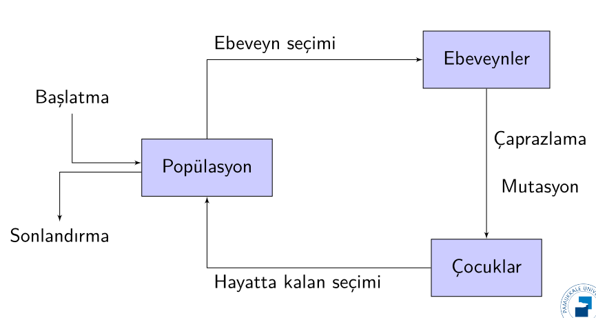
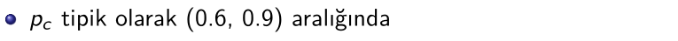
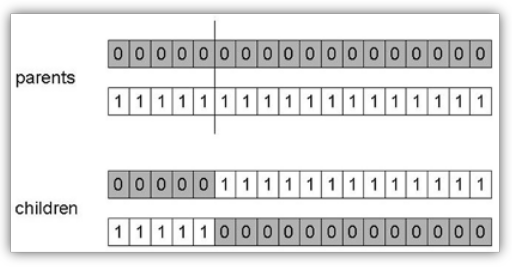
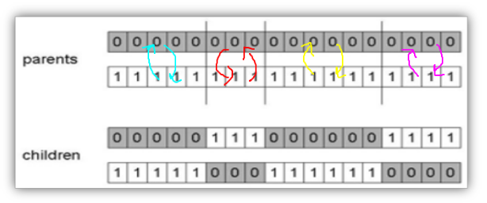
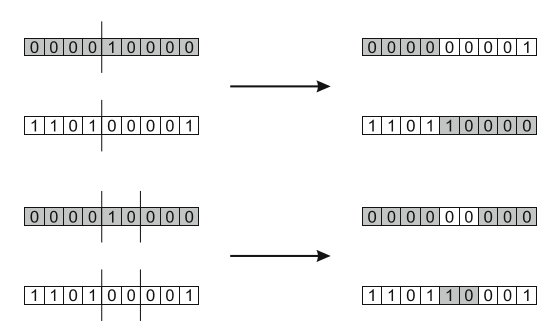
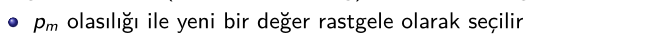
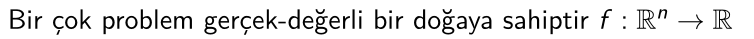

## **Evrimsel Hesaplama - `CENG 415`**

# **Bölüm 4 - Temsil, Mutasyon ve Rekombinasyon**

> **Chapter 4 - Representation, Mutation, and Recombination**

Bu bölümde;

- 4.1 [**Temsil ve çeşitlilik (varyasyon) operatörlerinin rolleri**](#41-temsil-ve-varyasyon-operatörlerinin-rolü)
- 4.2 **Genomların en yaygın temsilleri:**
  - 4.2.1 [**İkili Temsil (Binary Representation)**](#421-binary-representation)
  - 4.2.2 [**Tam Sayı Temsili (Integer Representation)**](#422-integer-representation)
  - 4.2.3 [**Real-Valued or Floating-Point Representation (Gerçek-değerli ya da Kayan-noktalı Temsil)**](#423-real-valued-or-floating-point-representation)
  - 4.2.4 [**Permutation Representation (Permütasyon Temsili)**](#424-permutation-representation)
  - 4.2.5 [**Tree Representation (Ağaç temsili)**](#425-tree-representation)

başlıklarından bahsedeceğiz.

## Evrimsel Hesaplama Şeması - `özet`

Konuyu geçen hafta derinlemesine işlemiştik.

**[Buradan](https://github.com/hasantezcan/evolutionary-computing-notes/blob/main/_data/weeks/week3/what-Is-an-evolutionary-algorithm.md#31-evrimsel-hesaplama-%C5%9Femas%C4%B1)** detaylı bilgiye ulaşabilirsiniz.

    
     
    <em>Evrimsel Hesaplama Şeması</em>

Bu hafta bu şemanın nasıl işlediğinin dışında bu hafta çözümlerimizi nasıl temsil ederiz bunun üzerine yoğunlaşacağız.

## 4.1 Temsil ve Varyasyon Operatörlerinin Rolü

- Bir EA geliştirmenin ilk ve en zor aşaması: **Problem için doğru temsili
seçmek**

**Varyasyon operatörleri:** Mutasyon ve çaprazlama   
İhtiyaç duyulan varyasyon operatörleri seçilen temsile bağlıdır

**Örneğin;** *Tam sayı temsili ile ağaç temsilin oparetörleri farklılık gösterecektir.*

TSP (GSP)

- Mümkün temsil biçimleri nelerdir?

### `SORU` Gezgin satıcı problemini nasıl temsil edebiliriz?

    
     
    <em></em>

- Bit dizisi ile mi?
- Permutasyon temsili mi? 

### `Cevap` 
- Her node'a bir değer verilebilir. Yapacağı seyahat yolunuda ardışıl sırada değerleri yerleştirerk temsil edilebilir.
  - 13245, 12345 gibi
- Ayrıca geçen haftanın sonunda konuştuğumuz **Knapsack problem** için de **bit temsili**ni kullanabiliriz.

## 4.2 Genomların en yaygın temsilleri:

# 4.2.1 Binary Representation 
> **İkili Temsil**

- İlk temsil biçimlerinden biridir
    - bit temsili gibi.
- Genotip, bir dizi ikili rakamdan oluşur

    
     
    <em></em>

## Mutation for Binary Representation
>  **İkili temsil için Mutasyon**

    
     
    <em></em>

- Bu gibi değişiklik çok büyük olduğu durumlarda grey kod kullanmalıyız.

    
     
    <em></em>

## Recombination for Binary Representation
> İkili temsil için çaprazlama 

### One-Point Crossover 
> Tek noktalı çaprazlama

- İki ebeveyn için rastgele bir nokta seçin [1, / − 1]
- Ebeveynleri bu geçiş noktasında ayırın
- Kuyrukları değiş tokuş ederek çocukları oluşturun

    

    
     
    <em></em>

## Alternatif Çaprazlama Operatörleri

- Neden başka çaprazlama operatörlerine ihtiyacımız var?
- Tek noktalı çaprazlamanın performansı değişkenlerin temsilde belirme
sırasına bağlıdır
    - Birbirine yakın genleri bir arada tutma olasılığı daha yüksektir
    - Ebeveynin zıt uçlarındaki genleri bir arada tutamaz
    - Bu durum konumsal ön yargı(positional bias) olarak bilinir
    - Problemimizin yapısı bilindiğinde faydalanılabilir, fakat genellikle böyle değildir

## n-Point Crossover 
> **n-noktalı Çaprazlama**

- Rastgele n çaprazlama noktası seçilir
- Bu noktalardan parçalanır
- Ebeveynler arasında değişen parçalar yapıştırılır
- 1-noktalı çaprazlamanın genel halidir (yine de biraz  konumsal önyargı içerir)

    
     
    <em>n-point crossover with n = 3</em>

    
     
    <em>One-point crossover (top) and n-point crossover with n = 2 (bottom)</em>

## Uniform Crossover
> **Birörnek Çaprazlama**

- Ebeveynlerden birisine **yazı**, diğerine **tura** verelim
- İlk çocuğun her bir geni için bir para(yazı-tura) atalım
- İkinci çocuk için genin ters kopyasını oluşturalım
- Kalıtım konumdan bağımsızdır

    
     
    <em></em>

## Çaprazlama VEYA Mutasyon

On yıllık uzun tartışma: **Hangisi varyasyon operatörü daha iyi / gerekli ?**

**`Cevap:`**(en azından oldukça geniş bir uzlaşma)

- Probleme bağlı olarak değişir, fakat;
- Genellikle **her ikisine de sahip olmak iyidir**
- Her ikisinin de başka rolü vardır
- Yalnızca mutasyon bulunan EA mümkündür ancak yalnızca çaprazlama bulunan EA çalışmaz
    - Çünkü sadece çaprazlama ile yeni değerler üretemez. Çalışmaz!

**Keşif (Exploration):** Arama alanında gelecek vaat eden alanları keşfetmek, yani problem hakkında bilgi edinmek 

**Sömürü (Exploitation):** Gelecek vaat eden bir alanda optimizasyon yapmak, yani bilgiyi kullanmak

- Aralarında işbirliği VE rekabet var
- Çaprazlama, **keşif amaçlıdır**, iki (ebeveyn) alan “arasında” bir yerde bir alana büyük bir sıçrama yapar
- Mutasyon, **sömürücüdür**, rastgele küçük sapmalar yaratır, böylece ebeveynin yakınında (alanında) kalır

- Yalnızca çaprazlama, iki ebeveynden gelen bilgileri birleştirebilir
- Yalnızca mutasyon yeni bilgiler sunabilir (aleller)
- Çaprazlama popülasyonun alel frekanslarını değiştirmez
- Optimuma ulaşmak için genellikle **“şanslı” bir mutasyona ihtiyacınız vardır**

# 4.2.2 Integer Representation

> Tamsayı Temsili

- Günümüzde genel olarak sayısal değişkenleri doğrudan kodlamanın daha iyi olduğu kabul edilmektedir (tam sayılar, kayan nokta değişkenleri)
- Bazı problemlerin doğal olarak **tamsayı değişkenleri** vardır, ör. **görüntü
işleme** parametreleri (sonraki sayfa)
- Diğerleri, sabit bir kümeden **kategorik değerler** alır, ör. *mavi, yeşil, sarı, pembe*
- n-noktalı / birörnek (Uniform Crossover) çaprazlama çalışır

## Mutation for Integer Representations
> **Tam sayı gösterimi için mutasyon**

- **Bit-çevirme (bit-fliping)** mutasyonu genişletilebilir
  - **Creep Mutation** (Sürünme), yani benzer değere geçme olasılığı daha yüksektir
    - Her gene p olasılığı ile küçük bir(pozitif veya negatif) değer ekleme
  - **Random Resetting** (Rastgele sıfırlama), özellikle kategori verilerinde
     

## Recombination for Integer Representation
> **Tam sayı gösteriminde çaprazlama**
    
- Çaprazlama, **ikili temsildeki** ile aynı şekilde gerçekleşmekte.

## Görüntü İşleme Katlama Örneği

    
     
    <em>Görüntü işleme katlama(convolution) örneği</em>

# 4.2.3 Real-Valued or Floating-Point Representation
> **Gerçek-değerli ya da Kayan-noktalı Temsil**

- 

    
     
    <em></em>

-  Örnek: Ackley’in fonksiyonu(evrimsel hesaplamada sıklıkla kullanılır)

    
     
    <em></em>

## Mutation for Real-Valued Representation
> **Gerçek değerler ile temsilin mutasyonu**

### Gerçek değerlerin bit dizileri ile temsili

    
     
    <em></em>

    
     
    <em></em>

## Uniform Mutation 
> **Birörnek Mutasyon**

    
     
    <em></em>

## Nonuniform Mutation
> **Birörnek Olmayan Mutasyon**

    
     
    <em></em>

## Normal (Gauss) Dağılım

    
     
    <em></em>

olasılık yoğunluk fonskiyonu

**sigma :** olasılık yoğunluk fonskiyonun ne kadar yayvan olacağını belirten değer

**mü :** ortalamasını belirtiyor

Kırmızı değer için mü değeri 0 varyansı 0.2 olan bir olasılık yoğunluk fonskiyonu dar olarak görülmekte. 

lacivert değerde varyans 5 olduğu için daha yayvan olduğunu görmekteseiniz.

Bu fonskiyonlara bakarak rastgele hangi değerleri ne kadar üreteceğimizi belirme olasığını bize göstermekte.

    
     
    <em>Normal(Gauss) Dağılım</em>

-sıgma +sigma arası değerler 68.2% olarak görülmektedir. 

Limit 0'a yaklaşır fakat ger değerin oluşma ihtimali mevcuttur.

## Self-Adaptive Mutation
> **Kendinden Uyarlamalı Mutasyon**

    
     
    <em></em>

- Mutasyon adım boyutu kullanıcı tarafından ayarlanmaz, ancak çözümle birlikte gelişir
- Evrimsel araştırma sürecinin farklı aşamalarında farklı mutasyon stratejileri uygun olabilir

    
     
    <em></em>

### `Bir` σ ile ilintisiz(uncorrelated) mutasyon

    
     
    <em></em>

Eşit olasılığa sahip mutantlar

    
     
    <em>Daire: Oluşturulma şansı aynı olan mutantlar</em>

### `n adet` σ ile ilintisiz(uncorrelated) mutasyon

    

Eşit olasılığa sahip mutantlar

    
     
    <em>Elips: Oluşturulma şansı aynı olan mutantlar</em>

## Correlated Mutations 
> **İlintili mutasyonlar**

    
     
    <em></em>

Mutasyon mekanizması şöyle olur:

    
     
    <em></em>

- **Kovaryans Matris Adaptasyon Evrim Stratejisi (CMA-ES) muhtemelen sayısal optimizasyon için en iyi EA’dır, bkz. CEC-2005 yarışması**

Eşit olasılığa sahip mutantlar

    
     
    <em>Elips: Oluşturulma şansı aynı olan mutantlar</em>

## Çaprazlama Operatörleri

**`Ayrık:`**

    
     
    <em></em>

- n-noktalı veya birörnek kullanılabilir

**`Ortada:`**

- Ebeveynler arasında çocuk oluşturma fikrinden yararlanır(aritmetik
rekombinasyon olarak da bilinir)

    
     
    <em></em>

- α parametresinin değeri:
    - sabit: birörnek aritmetik çaprazlama
    - değişken (Örn: popülasyonun yaşına bağlı)
    - her seferinde rastgele seçilir

## `Tek` Aritmetik Çaprazlama
> **Single Arithmetic Recombination**

    
     
    <em></em>

    
     
    <em></em>

## `Basit` Aritmetik Çaprazlama
> **Simple Arithmetic Recombination**

    
     
    <em></em>

    
     
    <em></em>

## `Tam` Aritmetik Çaprazlama
> **Whole Arithmetic Recombination**

    
     
    <em></em>

    
     
    <em></em>

## Karışım (Blend) Çaprazlama
> **Blend Crossover**

    
     
    <em></em>

## Farklı olası çocuklara genel bakış

    
     
    <em></em>

    
     
    <em></em>

## Çoklu Ebeveyn Çaprazlaması

- Evrimsel hesaplamayı doğanın pratikleri tarafından kısıtlamayabiliriz
- Mutasyonun n=1 ebeveyni ve “geleneksel” çaprazlamanın n=2 ebeveyni kullandığını düşünürsek, n>2 araştırılmaya değerdir
- 1960’lardan beri ortalıkta, hala nadir ama araştırmalar işe yaradığını
gösteriyor

## Çoklu Ebeveyn Çaprazlaması, tip 1

**Fikir:** ebevenleri parçalara ayırın ve yeniden birleştirin

**Örnek:** n ebeveyn için çapraz geçiş(çaprazlama)

- n − 1 çaprazlama noktası seçin(her ebeveynde aynı noktalar)
- Ebeveynlerin parçalarından n tane çocuğu, köşegen boyunca etrafını sararak oluşturun

    
     
    <em></em>

- Bu operatör 1 noktalı çaprazlamayı genelleştirir

## Çoklu Ebeveyn Çaprazlaması, tip 2

**Fikir:** (gerçek değerli) alellerin aritmetik kombinasyonu

n ebeveyn için aritmetik çaprazlama

- Çocuktaki i. alel ebeveynlerdeki i. alellerin ortalamasıdır

Çocuk ağırlık merkezi olur

Genetik algoritmada garip olabilir, evrim stratejisinde uzun süredir bilinen ve kullanılan

# 4.2.4 Permutation Representation
> **Permütasyon Temsili**

- Sıralama problemleri özel bir tür oluşturur
- **Görev (veya çözüm)**, bazı nesnleri belirli bir sıraya göre düzenlemektir
- **Örnek:** Üretim planlama: önemli olan hangi öğelerin diğerlerinden önce planlandığıdır (sıra)
- **Örnek:** Gezgin satıcı problemi (TSP): önemli olan hangi öğelerin yan yana oluştuğudur (komşuluk)
- Bu problemler genellikle bir permütasyon olarak ifade edilir
    - n değişken varsa, temsil, her biri bir kez beliren n tamsayının listesi
    gibidir

## Örnek: Gezgin satıcı porblemi

> Traveler Sales Man Example

**Problem:**

- Verilen n şehir için
- En kısa uzunluğa sahip tam turu bul

Kodlama:

- Şehirleri 1, 2, · · · , n şeklinde numaralandır
- Bir tam tur bir permütasyona eşittir(örn: n=4 için [1,2,3,4,], [3,4,2,1] mümkün)

Arama uzayı BÜYÜKTÜR: 30 şehir için 30! ≈ 10 32 mümkün tur sayısı vardır

    
     
    <em></em>

Bütün şehirlerin tek seferde gezen optimum rota nedir?

## Mutasyon

Normal mutasyon operatörleri kabul edilemez çözümlere yol açar

- Örneğin bit-tabanlı mutasyon için i. genin değeri j olsun
- i. gen için k değerine geçmek, k’nin iki defa yer almasına ve j’nin kaybolmasına neden olacaktır

Bu nedenle en az iki değer değiştirilmelidir

Mutasyon parametresi artık bazı operatörlerin her konumda ayrı ayrı uygulamak yerine tüm dizeye bir kez uygulanması olasılığını yansıtır

### Yer değiştirme (swap) mutasyonu

Rastgele iki alel seç ve yerlerini değiştir

    
     
    <em></em>

### Araya ekleme(insert) mutasyonu

Rastgele iki alel seç

İkinciyi birincinin arkasına gelecek şekilde taşı ve diğerlerini kaydır

Bu işlem, sıralama ve komşuluk bilgisinin çoğunu koruyacaktır

    
     
    <em></em>

### Karıştırma (scramble) mutasyonu

Genlerin rastgele bir alt kümesini seçin

Bu konumlardaki alelleri rastgele yeniden düzenleyin

    
     
    <em></em>

> **Bi dizinin elemanlarını karıştırmak istiyorum bunu nasıl yaparım?**

> Dizinin ilk elemanından son elemanına bir döngü oluşturup elemanları içinde gezmeye başlarım. Her bir eleman için dizi içinde rastgele bir indis atayıp bulunduğum değer ile onun yerini değiştiririm.

### Ters çevirme (inverse) mutasyonu

Rastgele iki alel seçin ve aralarındaki alt dizeyi ters çevirin

Çoğu komşuluk bilgisini korur(sadece ikisi bozulur) fakat sıralama bilgisi bozulur

    
     
    <em></em>

## Recombination for Permutation Representation 
> **Permütasyon temsili için çaprazlama operatörleri**

“Normal” çaprazlama operatörleri genellikle kabul edilemez çözümlere
yol açacaktır

    
     
    <em></em>

İki ebeveynden gelen sıralama ve komşuluk bilgilerini birleştirmeye odaklanan bir çok özelleşmiş operatör tasarlanmıştır

### Order crossover 
> **Order çaprazlama**

**Fikir,** öğelerin meydana geldiği göreceli düzeni korumaktır

**Sözde kod:**

1. İlk ebeveynden rastgele bir bölüm seçin
2. Bu bölümü ilk çocuğa kopyalayın
3. Birinci kısımda olmayan sayıları ilk çocuğa kopyalayın:
    - kopyalanan parçanın kesim noktasından başlayarak,
    - ikinci ebeveyndeki sırayı kullanarak
    - sona ulaşınca başa dönerek
4. Ebeveyn rollerinin tersine çevrildiği ikinci çocuk için benzer

Rastgele seçilen alt kümeyi birinci ebeveynden kopyala

    
     
    <em></em>

Kalan kısmı ikinci ebeveynden 1,9,3,8,2 sırasıyla kopyala

    
     
    <em></em>

### Partially Mapped Crossover (PMX) 
> **Kısmen eşleşmiş çaprazlama (PMX)**

**P1 ve P2 için sözde kod:**

1. Rastgele iki geçiş noktası seçin ve aralarındaki segmenti ilk ebeveynden (P1) ilk çocuğa kopyalayın.
2. İlk geçiş noktasından başlayarak, ikinci ebeveynin (P2) bu segmentinde kopyalanmamış olan öğeleri arayın.
3. Bunların her biri için (i diyelim), P1’den yerine hangi öğenin (j diyelim) kopyalandığını görmek için yavruya bakın.
4. i’yi P2’de j’nin işgal ettiği konuma yerleştirin, çünkü j’yi oraya koymayacağımızı biliyoruz (zaten dizimizde olduğu gibi).
5. P2’de j’nin işgal ettiği yer yavruda zaten bir k öğesi tarafından doldurulmuşsa, P2’de k’nin işgal ettiği konuma i’yi koyun.
6. Çaprazlama bölümdeki unsurları ele aldıktan sonra, bu yavruda kalan pozisyonlar P2’den doldurulabilir ve ikinci çocuk, ebeveyn rolleri tersine çevrilerek benzer şekilde yaratılır.

    
     
    <em></em>

### PMX Örnek

..  

..  

..  

..  

### Cycle Crossover 
> **Döngü çaprazlama**

**Temel fikir:** Her alel, konumu ile birlikte bir ebeveynden gelir.

**Sözde kod:**

1. Aşağıdaki şekilde P1’den alel döngüsü yapın:
    1. P1’in ilk aleli ile başlayın
    2. P2’de aynı konumdaki alele bakın
    3. P1’de aynı alelin pozisyonuna gidin
    4. Bu aleli döngüye ekleyin
    5. P1’deki ilk alele rastlayana kadar adım **b’**den **d’**ye kadar olan kısmı tekrarlayın
2. İlk çocuktaki döngünün alellerini birinci ebeveynde sahip oldukları pozisyonlara yerleştirin 
3. Sonraki döngüyü ikinci ebeveynden alın

**Adım 1: döngüleri belirle**

    
     
    <em></em>

**Adım 2: alternatif döngüleri çocuklara kopyala**

    
     
    <em></em>

child 1 için kopyalama işlemi şekildeki gibi yapılmış child 2 için aynı işlemin paraleli yapılmalıdır.

örnek deftere çizildi

### Edge crossover 
> **Kenar çaprazlama**

İki ebeveynde hangi kenarların bulunduğunu listeleyen bir tablo oluşturarak başlar, eğer her ikisi için de **`ortak bir kenar` varsa + ile işaretlenir**

Örn: **[1 2 3 4 5 6 7 8 9]** ve **[9 3 7 8 2 6 5 1 4]**

    
     
    <em>kenar tablosu</em>

    
     
    <em></em>

**Sözde kod:**

1. Rastgele bir başlangıç elemanı seçin ve çocuğa ekleyin
2. `mevcut_eleman=kayit` atamasını yapın
3. Tabloda mevcut elemana olan tüm referansları silin
4. Listeyi mevcut eleman için kontrol edin:
    1. Eğer `ortak kenar varsa`, sıradaki eleman olarak bunu seçin
    2. Aksi halde listedeki en kısa listeye sahip olan elemanı seçin
    3. Eşitlik durumunda rastgele (standart olması için küçük olan)
5. Boş bir liste gelmişse
    1. Rastgele bir eleman seçilir

    
     
    <em></em>

1'i aldık ve komuşularına baktık 1'in komuşularından en az edge'e sahip olanı ikinci eleman olarak belirledik ve tablodaki tüm 1 leri ve seçilen elemanı listelerden çıkartacağız. şeklinde devam ediyor.

### Kenar çaprazlama örnek

...  

...  

...  

# 4.2.5 Tree Representation 
> **Ağaç temsili**

- Ağaçlar evrensel bir biçimdir

    
     
    <em></em>

- **Kaynak kod:**

    
     
    <em></em>

### Aritmatik ifade örneği

    
     
    <em></em>

Bu ifadenin aritmatik ifadenin **ağaç temsili (expression tree)** şekildeki gibidir.

    
     
    <em>ağaç temsili (expression tree)</em>

### Mantıksal ifade örneği

    
     
    <em></em>

Bu ifadenin mantıksal ifadenin **ağaç temsili (expression tree)** şekildeki gibidir.

    
     
    <em></em>

### Kaynak kod ifade örneği

    
     
    <em></em>

Bu ifadenin kaynak kod ifadesinin **ağaç temsili (expression tree)** şekildeki gibidir. Bu gösterim biraz daha soyut kalmaktadır. Bir parser ile bu kod parse edildiğinde daha çok node üretilecektir.

    
     
    <em></em>

- Genetik algoritma, evrim stratejisi, evrimsel programlama yöntemlerinde kromozomlar **doğrusal yapılardır** (bit dizesi, tamsayı dizesi, gerçek-sayı vektörü, permütasyon gibi)
- Ağaç yapılı kromozomlar **doğrusal olmayan yapılardır**
- Genetik algoritma, evrim stratejisi, evrimsel programlama yöntemlerinde kromozom boyutu sabittir
- Genetik programlamadaki ağaçlar **derinlik ve genişlik** olarak değişiklik gösterebilir

- Sembolik ifadeler aşağıdakilerle tanımlanabilir.
    - **Terminal kümesi T**
    - **Fonksiyon kümesi F** (fonksiyon sembollerinin **`arite bilgisi (fonksiyonun aldığı parametre sayısı)`** ile)

    Henüz gördüğümüz *aritmatik ifade örneğinde* **terminal kümesi** ve **fonskiyon kümesini** belirleyecek olursak; 

    > **T = {2, π, 3, 5, 1, x, y}**

    > **F = {+, -, *, / }**

- Aşağıdaki **genel özyinelemeli** tanımlama benimsenir
    - Her t ∈ T doğrudur

    

    
     
    <em></em>

  - Doğru ifadelerin başka biçimi yoktur
- Genel olarak **genetik programlamada** ifadelerin türü yoktur (aynı türden) farklı bi tip söz konusu değildir.
    - **kapanış (closure) özelliği:** herhangi bir f ∈ F , g ∈ F fonksiyonunu argüman olarak alabilir

## Mutation for Tree Representation 
> **Ağaç temsili için mutasyon**

- **En yaygın mutasyon:** rastgele seçilen alt ağacı rastgele oluşturulmuş ağaçla değiştirin

    
     
    <em></em>

- Mutasyonun iki parametresi vardır:

    

    
     
    <em></em>

  - Değiştirilecek alt ağacın kökü olarak bir iç nokta seçme olasılığı

    
     
    <em></em>

- Bu işin duayeni sayılan **Koza** 92 yılında **hiç mutasyon yapılmamasını önerir (mutasyon olasılığı 0 olarak tutulmalı şekilde bir fikir ortaya atıyor.)**
- Çocuğun boyutu ebeveynin boyutunu aşabilir
    - Ağaçı fazla şişirmeden bir sınırlama getirmelidir.

## Recombination for Tree Representation
> **Ağaç temsili için çaprazlama**

- **En yaygın rekombinasyon:** ebeveynler arasında rastgele seçilen iki alt ağaç değişimi

    **kapanış (closure) özelliğinden dolayı** bütün node'ların geri dönüş değerleri aynı tipten olacağından çaprazlama yaparken bir sıkıntı çekmiyoruz.

- Rekombinasyonun iki parametresi vardır:

  - 

        
         
        <em></em>
    

  - Her ebeveynin içinde çaprazlama noktası olarak bir iç nokta seçme olasılığı
- Yavruların boyutu ebeveynlerinkini aşabilir

    
     
    <em></em>

    
     
    <em></em>

## Kaynaklar

- [Öğr. Gör. Şevket Umut Çakır](https://www.pau.edu.tr/sucakir/) ders sunumları.

- [`Introduction to Evolutionary Computing 2nd Edition`](https://www.springer.com/gp/book/9783662448731) ders kitabı.

- Wolfgang Banzhaf, Peter Nordin, Robert E Keller, and Frank D Francone. 
Genetic programming: An Introduction.
Springer, 1998.
- John R Koza and John R Koza. 
Genetic programming: on the programming of computers by means of natural selection, volume 1.
MIT press, 1992.